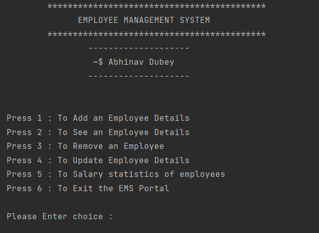

# Employee-Management-System
This repository consists of Java Program for Employee Management System. In this repository I have created a TUI program for Employee Management System which consists of 5 different operation. 
(1) Adding Employee   (2) Removing Employee  (3) Updating Employee   (4) Viewing details of Employee   (5) See salary statistics of employees 

The EmployeeFiles folder contains ten examples of employee data, and newly added employees are added to the folder in the "employee ID.txt" format. 
The Program is completely based on OOPs concept.

# How to run ?
For Compliation : <code>javac EmployManagementSystem.java</code>

To Run Program  : <code>java EmployManagementSystem</code>
